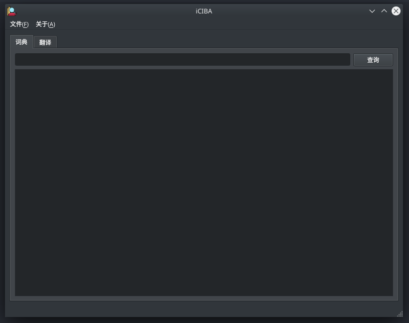

# iCIBA

A client of iCIBA fro Linux.



## Installation

Ubuntu:

### deb install

```sh
$ wget https://github.com/TaipaXu/iCIBA/releases/download/v0.1.0/iCIBA_0.1.0_amd64.deb
$ sudo dpkg -i ./iCIBA_0.1.0_amd64.deb
```

### AppImage install

```sh
$ wget https://github.com/TaipaXu/iCIBA/releases/download/v0.1.0/iCIBA-0.1.0-x86_64.AppImage
$ wget https://github.com/TaipaXu/iCIBA/releases/download/v0.1.0/iCIBA-GUI-0.1.0-x86_64.AppImage
$ chmod +x iCIBA-0.1.0-x86_64.AppImage
$ chmod +x iCIBA-GUI-0.1.0-x86_64.AppImage
$ sudo mv ./iCIBA-0.1.0-x86_64.AppImage /usr/bin/iciba
$ sudo mv ./iCIBA-GUI-0.1.0-x86_64.AppImage /usr/bin/iciba-gui
```

## Compiling

```sh
$ git clone --recursive https://github.com/TaipaXu/iCIBA.git && cd iciba
$ mkdir build && cd build
$ cmake ../src/
$ make
```

## CLI Usage

Translate:

```sh
$ iciba miss
miss
英[mɪs]  美[mɪs]
n. （用于姓名或姓之前，对未婚女子的称呼）小姐; 女士; 失误
v. 漏掉; 错过（机会）; 思念; 没遇到
复数: misses  第三人称: misses  过去式: missed  过去分词: missed  现在分词: missing
```
```sh
$ iciba -q miss
miss
英[mɪs]  美[mɪs]
n. （用于姓名或姓之前，对未婚女子的称呼）小姐; 女士; 失误
v. 漏掉; 错过（机会）; 思念; 没遇到
复数: misses  第三人称: misses  过去式: missed  过去分词: missed  现在分词: missing
```

```sh
$ iciba How I miss you!
How I miss you!
我多么想念你！
```

```sh
$ iciba -q How I miss you!
How I miss you!
我多么想念你！
```

Get the history:

```sh
$ iciba -i 0
I
How I miss you!
```

```sh
$ iciba -i 1
How I miss you!
```
# License

[GPL-3.0](LICENSE)
